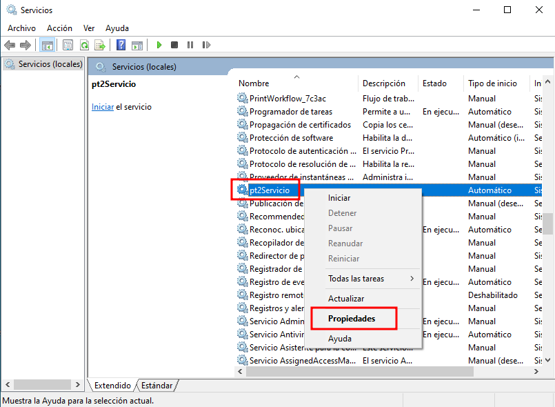
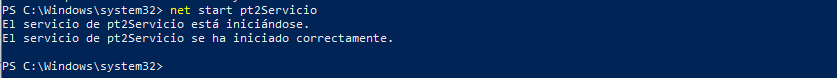

# Creación de un servicio en Windows

En esta práctica explico cómo creé un servicio en Windows que ejecuta automáticamente un script de PowerShell usando NSSM (Non-Sucking Service Manager). Usé NSSM para instalar un script como servicio y configurar el ejecutable, los argumentos, el directorio de inicio y la cuenta de ejecución.


Resumen:
- Un servicio es un proceso en segundo plano que puede iniciarse automáticamente al arrancar el sistema.
- NSSM me permite convertir scripts/aplicaciones en servicios gestionados por el sistema con opciones avanzadas de configuración.

---

## Instalación del servicio con NSSM

Ejecuto NSSM desde PowerShell para instalar el servicio:
```powershell
C:\Users\dariel\Desktop\nssm-2.24\nssm-2.24\win64\nssm.exe install pt2Servicio
```

Se me abrirá la interfaz gráfica de NSSM. Configuro los campos principales:


Campos y valores que utilicé:

- Path:
    ```
    system32\WindowsPowerShell\v1.0\powershell.exe
    ```
    Indica que el servicio ejecutará PowerShell.
- Startup directory:
    ```
    C:\Users\dariel\Desktop\Servicios
    ```
    Carpeta donde está el script.
- Arguments:
    ```
    -ExecutionPolicy Bypass -File "C:\Users\dariel\Desktop\Servicios\pt2.ps1"
    ```
    Permite ejecutar pt2.ps1 saltando la política de ejecución.
- Service name:
    ```
    pt2Servicio
    ```
    Nombre del servicio que creé.

Al pulsar "Install service", obtengo la confirmación de instalación:



---

## Configuración del servicio en Windows

Puedo ver el servicio en la lista de servicios del sistema:


Desde la consola de servicios puedo:
- Iniciar, detener o reiniciar el servicio.
- Configurar tipo de inicio: Automático, Manual o Deshabilitado.
- Ajustar propiedades como la cuenta bajo la cual se ejecuta.

En la pestaña "Iniciar sesión" selecciono una cuenta con los privilegios necesarios:



---

## Inicio del servicio y verificación

Inicio el servicio desde PowerShell:
```powershell
net start pt2Servicio
```


En la consola de servicios veo el servicio en estado "En ejecución":

---

## Script asociado (pt2.ps1)

A continuación el script real utilizado y una breve explicación.

```powershell
# Mostrar notificación personalizada
Add-Type -AssemblyName System.Windows.Forms
[System.Windows.Forms.MessageBox]::Show("¡Bienvenido! El sistema se ha iniciado correctamente.", "Servicio Activo")

# Ruta del log
$logPath = "C:\Users\dariel\Desktop\Servicios\pt2.log"

# Recopilar información del sistema
$usuario = $env:USERNAME
$equipo = $env:COMPUTERNAME
$ip = (Get-NetIPAddress -AddressFamily IPv4 -InterfaceAlias "Ethernet" | Where-Object {$_.IPAddress -ne "127.0.0.1"}).IPAddress
$ram = [math]::Round((Get-CimInstance Win32_ComputerSystem).TotalPhysicalMemory / 1GB, 2)
$inicio = (Get-CimInstance Win32_OperatingSystem).LastBootUpTime

# Guardar información inicial
Add-Content -Path $logPath -Value "`n--- Inicio de sesión ---"
Add-Content -Path $logPath -Value "Usuario: $usuario"
Add-Content -Path $logPath -Value "Equipo: $equipo"
Add-Content -Path $logPath -Value "IP: $ip"
Add-Content -Path $logPath -Value "RAM: $ram GB"
Add-Content -Path $logPath -Value "Inicio del sistema: $inicio"
Add-Content -Path $logPath -Value "-------------------------`n"

# Monitorizar procesos abiertos por el usuario
$procesosPrevios = @()

while ($true) {
    $procesosActuales = Get-Process | Select-Object -ExpandProperty ProcessName
    $nuevos = $procesosActuales | Where-Object { $_ -notin $procesosPrevios }

    foreach ($proceso in $nuevos) {
        $hora = Get-Date -Format "HH:mm:ss"
        Add-Content -Path $logPath -Value "$hora - Aplicación iniciada: $proceso"
    }

    $procesosPrevios = $procesosActuales
    Start-Sleep -Seconds 5
}
```

__Explicación:__

- Muestra una notificación inicial mediante System.Windows.Forms.
- Registra en un fichero de log información del sistema (usuario, equipo, IP, RAM y hora de arranque).
- Monitoriza procesos y añade al log las aplicaciones que aparecen nuevas, comprobando cada 5 segundos.
- Nota: al ejecutarlo como servicio hay que asegurar permisos y rutas; la notificación gráfica puede no mostrarse si el servicio no interactúa con el escritorio (sesión 0).

---

## Pasos finales para automatizar el arranque

- Configuro el servicio con inicio automático.
- Reinicio el sistema y verifico que el servicio se inicia correctamente.
- Compruebo permisos y dependencias (cuenta de servicio, rutas accesibles, variables de entorno) para evitar errores durante el arranque.

---