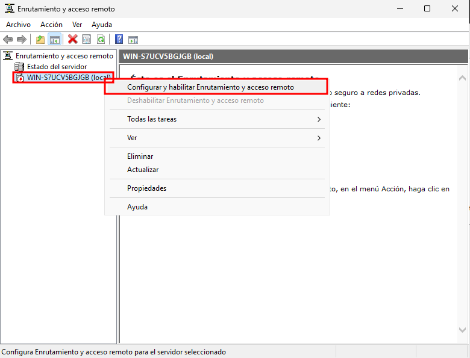
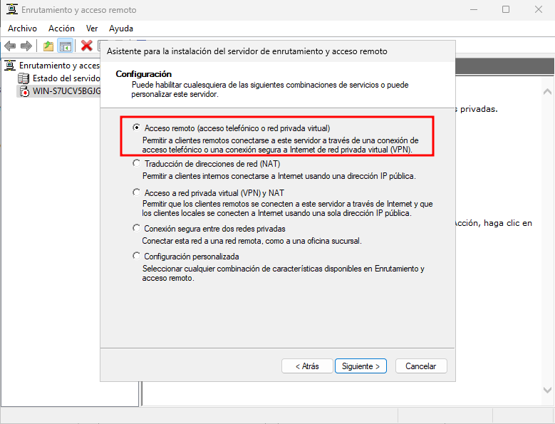
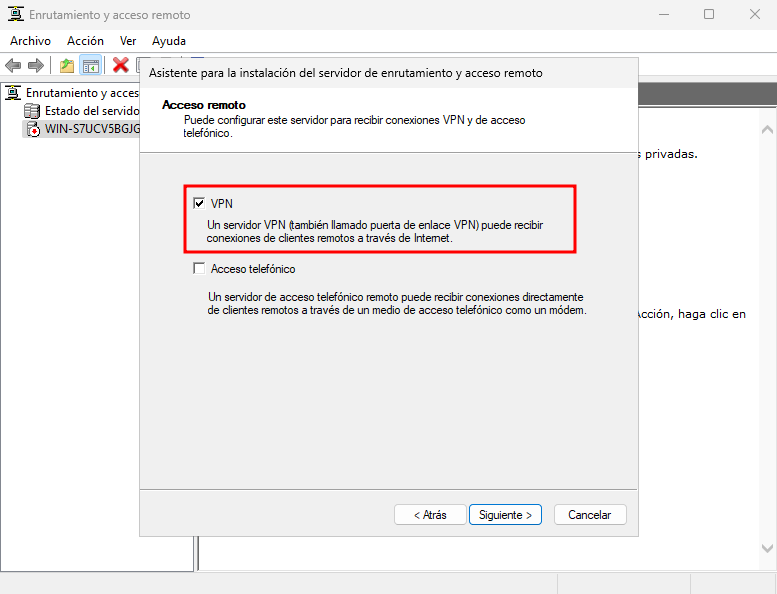
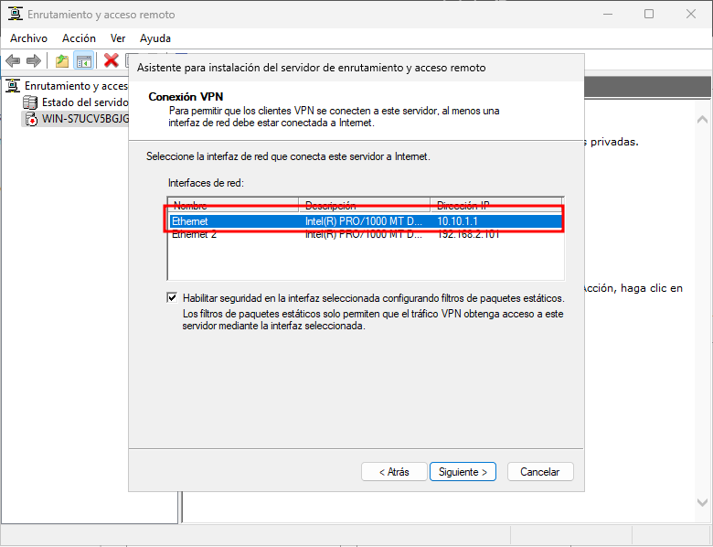
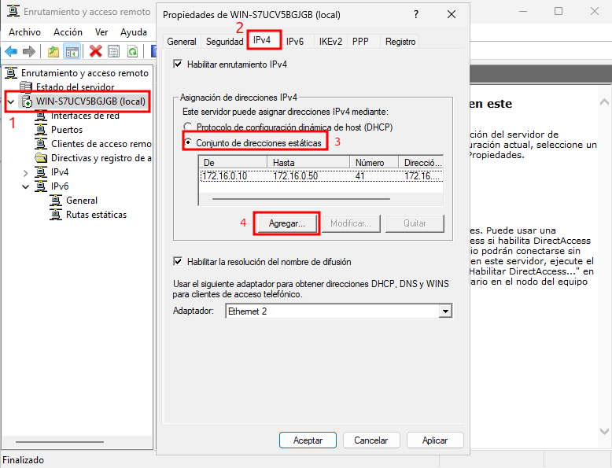
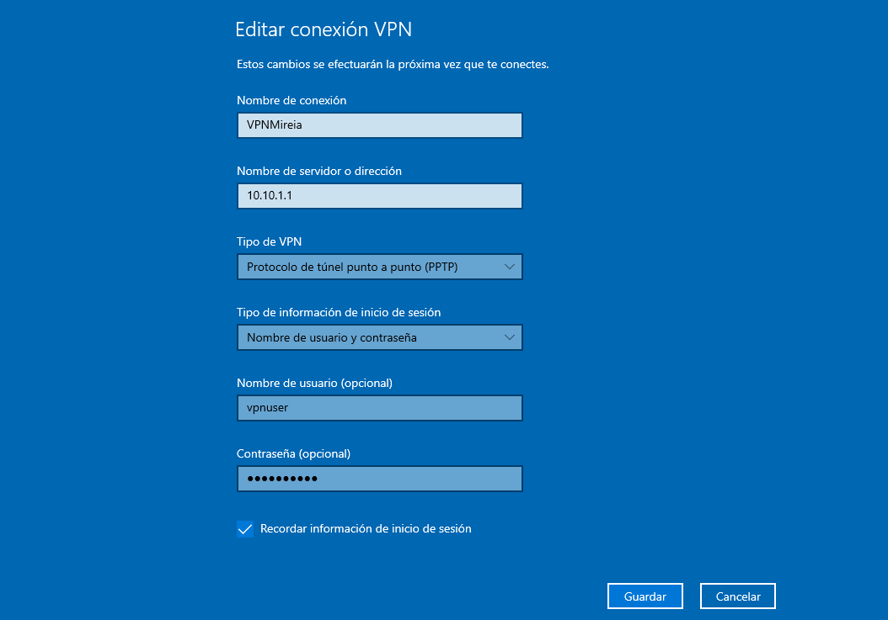
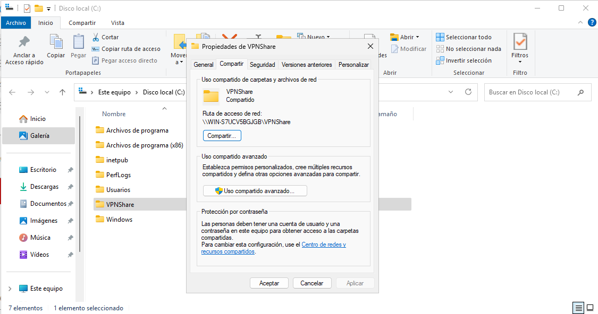
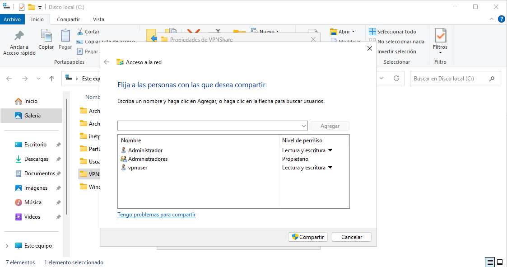
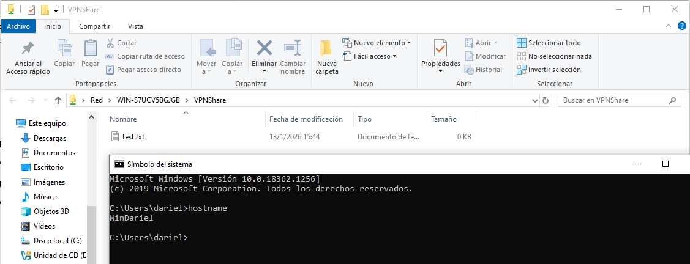

# __Servidor VPN__

## __Instalación de Características__

Para poder levantar un servidor VPN es necesario agregar el rol Acceso remoto desde el asistente de Windows Server. Dentro de este rol se incluyen los servicios DirectAccess y VPN (RAS) junto con el componente de Enrutamiento, ambos necesarios para permitir conexiones remotas y gestionar el tráfico del túnel VPN.

---
## __Configuración del Servidor__

Una vez instalado el rol correspondiente, se accede a la consola de administración desde el menú Herramientas del Administrador del servidor. Dentro de este menú se debe seleccionar la opción Enrutamiento y acceso remoto, que permitirá iniciar la configuración del servicio VPN y habilitar las funciones necesarias para gestionar conexiones remotas.

---
Para continuar con la configuración, se selecciona el servidor dentro de la consola y se utiliza la opción Configurar y habilitar Enrutamiento y acceso remoto. Esto inicia el asistente que permitirá activar los servicios necesarios para que el servidor funcione como punto de acceso VPN y gestione las conexiones entrantes.

---
Para continuar con el asistente, se selecciona la opción Acceso remoto (acceso telefónico o red privada virtual). Esta configuración habilita al servidor para aceptar conexiones remotas mediante VPN, permitiendo que los clientes externos puedan autenticarse y establecer un túnel seguro hacia la red interna.

---
En este paso se habilita específicamente la opción VPN, indicando que el servidor actuará como puerta de enlace para recibir conexiones remotas a través de Internet. Al seleccionar esta opción, el asistente prepara la configuración necesaria para que los clientes puedan establecer un túnel seguro hacia la red interna del servidor.

---
En este punto se selecciona la interfaz de red que el servidor utilizará para recibir las conexiones VPN. Se escoge la interfaz conectada hacia Internet o hacia la red externa, ya que será la encargada de gestionar el tráfico entrante de los clientes remotos. Esta selección permite al asistente configurar las rutas y reglas necesarias para que el túnel VPN funcione correctamente.

---
Para continuar con la configuración, se selecciona la opción Automáticamente para la asignación de direcciones IP. Con esta opción, el servidor utilizará el servicio DHCP existente para entregar direcciones a los clientes VPN; en caso de no haber un DHCP disponible, el propio servidor generará las direcciones de forma interna. Esto permite que los clientes remotos obtengan una IP válida dentro del rango configurado al establecer el túnel.

---
En este paso se indica que la autenticación de las solicitudes se gestionará directamente desde Enrutamiento y acceso remoto, por lo que se selecciona la opción No, usar Enrutamiento y acceso remoto para autenticar las solicitudes de conexión. Con esto, el propio servidor será el encargado de validar las credenciales de los usuarios que intenten conectarse mediante VPN, sin necesidad de integrar un servidor RADIUS externo.

---
Tras completar todas las fases del asistente, se muestra un resumen indicando la interfaz por la que los clientes VPN se conectarán, así como la red que se asignará para el direccionamiento interno. Con esta información confirmada, solo queda finalizar el asistente para que el servicio de Enrutamiento y acceso remoto quede habilitado y el servidor empiece a funcionar como servidor VPN.

---
## __Configurar el rango de direcciones para los clientes del túnel VPN__

Para definir qué direcciones IP recibirán los clientes que se conecten al túnel VPN, se accede a las propiedades del servidor dentro de Enrutamiento y acceso remoto. En la pestaña IPv4, se selecciona la opción Conjunto de direcciones estáticas y se utiliza el botón Agregar para establecer el rango que se asignará de forma exclusiva a los usuarios conectados mediante VPN.

---
Para permitir que el usuario pueda autenticarse mediante VPN, se accede a sus propiedades y dentro de la pestaña Marcado se habilita la opción Permitir acceso. Con este ajuste, el servidor autoriza explícitamente a esta cuenta para establecer conexiones remotas a través del servicio de Enrutamiento y acceso remoto, asegurando que solo usuarios aprobados puedan acceder al túnel VPN.

---
## __Configuración de la conexión VPN en el cliente__

En el equipo cliente se procede a crear la conexión VPN introduciendo la información necesaria: un nombre identificativo para la conexión, la dirección IP del servidor VPN y el protocolo a utilizar. También se especifican las credenciales del usuario autorizado para establecer el túnel. Estos parámetros permiten que el cliente pueda autenticar correctamente la conexión y comunicarse con el servidor de forma segura.

---
Una vez creada la conexión VPN en el cliente, esta aparece disponible en el panel de configuración, permitiendo gestionarla directamente desde el sistema. En este punto se puede revisar su estado, acceder a las opciones avanzadas y preparar la conexión para su uso.
Tras iniciar la conexión, el cliente establece correctamente el túnel con el servidor VPN y el estado cambia a Conectado. Desde esta misma ventana es posible mantener la sesión activa o desconectarla cuando sea necesario, verificando así que la comunicación con el servidor se realiza de forma correcta.

---
## __Configuración de la carpeta accesible únicamente por el usuario VPN__
Para proteger el recurso compartido y asegurar que únicamente el usuario conectado por VPN pueda acceder, se crea una carpeta dedicada y se configura como recurso compartido. Desde las propiedades de la carpeta se habilita el uso compartido y se asigna un nombre identificativo accesible a través de la red. Este paso permite que la carpeta pueda ser alcanzada mediante el túnel VPN una vez que el usuario esté autenticado.

---
Para definir correctamente quién puede acceder al recurso compartido, se selecciona únicamente al usuario destinado para la VPN y se le asignan los permisos necesarios. En este caso, se agrega el usuario vpnuser y se establece su nivel de permiso en Lectura y escritura, garantizando que solo él pueda interactuar con la carpeta cuando acceda a través del túnel VPN. Los demás usuarios mantienen permisos restringidos o no tienen acceso, reforzando el control de seguridad del recurso.

---
Para comprobar el acceso a la carpeta compartida desde el cliente conectado por VPN, se utiliza el comando Ejecutar introduciendo la ruta UNC del recurso. Al indicar \\WIN-S7UCV5BGJGB\VPNShare, el sistema intenta acceder directamente a la carpeta a través del túnel VPN, verificando así que la conexión está activa y que el usuario dispone de los permisos adecuados para interactuar con el recurso.

---
Para finalizar la comprobación, se accede nuevamente al recurso compartido VPNShare desde el cliente conectado por VPN y se confirma que el archivo test.txt es visible y accesible. La ventana del símbolo del sistema muestra el hostname del equipo cliente, lo que verifica que el acceso se realiza realmente desde la máquina remota a través del túnel VPN. Con esto se confirma que la configuración es correcta y que únicamente el usuario autenticado por VPN puede acceder a la carpeta protegida.

