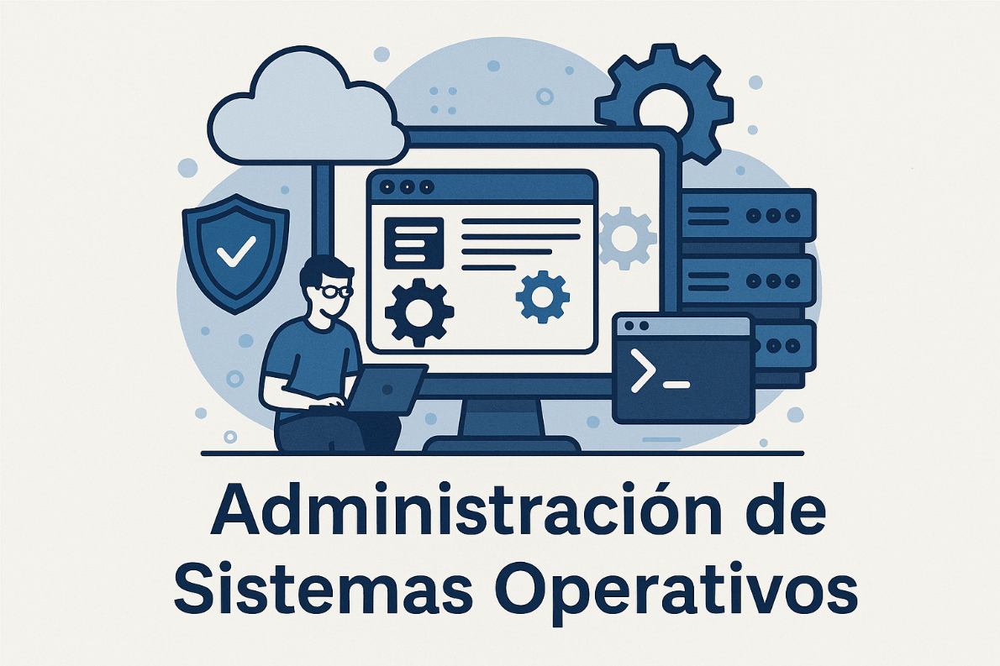

# Administración de Sistemas Operativos

¡Bienvenido/a a mi página de Administración de Sistemas Operativos!  
Aquí encontrarás proyectos, recursos y documentación relacionados con la gestión y administración de sistemas operativos, tanto Linux como Windows. Este espacio está pensado para compartir conocimientos, experiencias y avances en los diferentes proyectos desarrollados en el ámbito de los sistemas operativos.  
Explora los contenidos, participa y aprovecha al máximo este repositorio de aprendizaje colaborativo.

    

