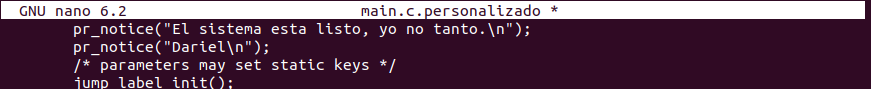
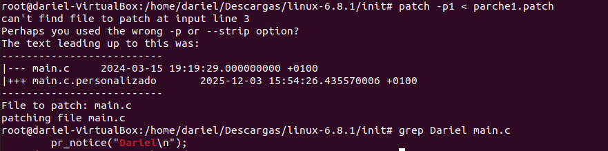
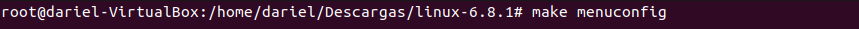
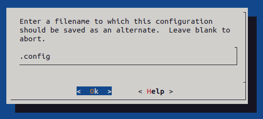
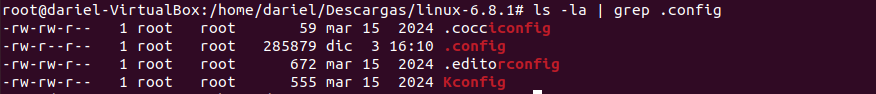
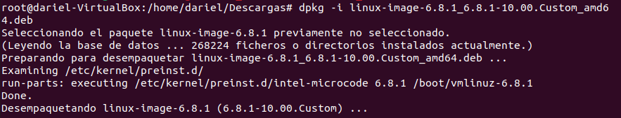

# __Gestión de Kernels__

## __Configuración y parches__

En esta primera captura se puede ver el proceso para preparar la modificación del kernel. Acceder al directorio init dentro del código fuente de Linux, donde se encuentran los archivos que controlan la inicialización del sistema. Crear una copia del archivo main.c con el nombre main.c.personalizado para trabajar sobre él sin alterar el original. Abrir el archivo copiado con el editor nano para realizar las modificaciones.

---
En la segunda captura se puede ver el contenido editado. Añadir dos mensajes mediante la función pr_notice() para que se muestren en el log del sistema durante el arranque: uno indicando “El sistema está listo, yo no tanto” y otro con el nombre “Dariel”. Personalizar el kernel y recompilarlo para aplicar los cambios.

---
En esta parte se puede observar cómo generar el parche que contiene las diferencias entre el archivo original y el modificado. Ejecutar el comando diff -u main.c main.c.personalizado > parche1.patch para crear un fichero que almacene los cambios realizados. Este archivo permitirá aplicar la modificación sin necesidad de reemplazar todo el código fuente.
Después, comprobar el contenido del directorio para confirmar que el parche se ha creado correctamente junto a los demás archivos. Este paso es clave para distribuir la personalización de forma ordenada y reutilizable.

---
Se intenta aplicar el parche creado anteriormente usando el comando patch -p1 < parche1.patch. El sistema indica que no encuentra el archivo a parchear debido a la ruta, lo que sugiere que se debe ajustar la opción -p o la ubicación del fichero. Finalmente, se confirma que el contenido del archivo main.c incluye la línea personalizada mediante el comando grep Dariel main.c.

---
Se procede a editar el archivo de configuración de GRUB ubicado en /etc/default/grub utilizando el editor nano. Este paso es necesario para ajustar parámetros relacionados con el arranque del sistema antes de compilar y probar el kernel modificado. Lo único que se realiza es comentar las líneas resaltadas.

---
se ejecuta el comando update-grub para aplicar los cambios realizados en la configuración. El sistema genera el archivo de configuración actualizado y detecta las imágenes del kernel disponibles en /boot, incluyendo la versión que se ha personalizado. Este paso asegura que el gestor de arranque reconozca el nuevo kernel antes de reiniciar.

---
En este paso se ejecuta el comando make menuconfig para abrir la interfaz de configuración del kernel. Este comando permite personalizar las opciones de compilación mediante un menú interactivo, donde se pueden habilitar o deshabilitar características específicas del kernel antes de proceder a la compilación.

---
Una vez abierto el menú de configuración del kernel con make menuconfig, acceder al apartado File systems para revisar las opciones relacionadas con los sistemas de archivos. Dentro de este submenú, localizar la opción JFS debugging, que inicialmente aparece deshabilitada, y proceder a activarla. Este cambio permite compilar el kernel con soporte de depuración para el sistema de archivos JFS, lo que resulta útil para diagnosticar problemas y analizar su comportamiento en entornos donde se utilice este tipo de sistema.

---
Después de realizar los cambios en la configuración del kernel, guardar la configuración en el archivo .config cuando el sistema lo solicita, confirmando el nombre por defecto. A continuación, verificar que el archivo se ha creado correctamente utilizando el comando ls -la | grep .config, donde se muestra el fichero .config junto a otros archivos relacionados con la configuración del kernel. Este paso asegura que las opciones seleccionadas en el menú se han guardado y están listas para la compilación.

---
Después de guardar la configuración, preparar el entorno para la compilación ejecutando el comando make prepare, lo que sincroniza y genera los archivos necesarios para iniciar el proceso. A continuación, comenzar la construcción del paquete del kernel utilizando make-kpkg --initrd kernel_image kernel_headers, que crea la imagen del kernel y los encabezados, además de generar los scripts y directorios requeridos para empaquetar el kernel en formato compatible con Debian. Este paso es esencial para poder instalar el kernel personalizado en el sistema.

---
Después de completar la compilación y empaquetado del kernel, comprobar el contenido del directorio para confirmar la generación de los archivos .deb. En la imagen se observa la presencia de linux-headers y linux-image, ambos con la versión personalizada y preparados para su instalación en el sistema. Estos paquetes son esenciales: los headers permiten compilar módulos adicionales y la imagen contiene el kernel listo para ser usado.

---
Finalmente, instalar el kernel personalizado utilizando el comando dpkg -i linux-image-6.8.1_6.8.1-10.00.Custom_amd64.deb. Durante el proceso, el sistema desempaqueta el archivo y ejecuta los scripts necesarios en /etc/kernel/preinst.d, preparando la imagen del kernel para su uso. Este paso confirma que la instalación se realiza correctamente y que el nuevo kernel queda registrado en el sistema, listo para ser utilizado en el próximo arranque.

---
Tras reiniciar el sistema, comprobar en el menú de GRUB que aparece la nueva entrada correspondiente al kernel personalizado, en este caso la versión 6.8.1, lo que indica que la instalación se realizó correctamente. Una vez iniciado el sistema con este kernel, verificar la versión activa mediante el comando uname -r y confirmar que la opción habilitada en la configuración, JFS debugging, está presente utilizando grep JFS_DEBUG /boot/config-$(uname -r), donde se muestra el valor CONFIG_JFS_DEBUG=y. Este resultado confirma que los cambios aplicados durante la compilación se han integrado en el kernel en ejecución.

